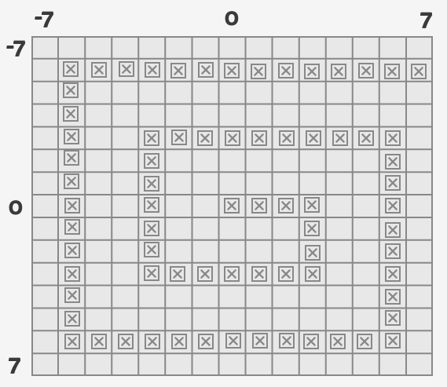

[](https://travis-ci.org/aguimaraes/spiral)
[](https://styleci.io/repos/64354281)
[](https://www.codacy.com/app/alvaroguimaraes/spiral?utm_source=github.com&amp;utm_medium=referral&amp;utm_content=aguimaraes/spiral&amp;utm_campaign=Badge_Grade)

# Archimedean Spiral Generator

This library will generate a collection (array) 
of points (SpiralPoint) that will form a perfect Archimedean Spiral.

## Usage

```php
$builder = new Builder();
$builder->setTotal(3);
var_dump($builder->generate());
```

This will print:

```php
array:3 [
  0 => Aguimaraes\Spiral\SpiralPoint {
    #x: 0
    #y: 0
  }
  1 => Aguimaraes\Spiral\SpiralPoint {
    #x: 1
    #y: 0
  }
  2 => Aguimaraes\Spiral\SpiralPoint {
    #x: 1
    #y: 1
  }
]
```

## Advanced Example

The expected spiral:



The code:

```php
$builder = new Builder();
$builder->setTotal(74);
$builder->setStep(3);
$builder->generate();
``` 

## Parameters

* __Total:__ The number of points that should be generated.

```php
$builder = new Builder();
$builder->setTotal(120);
$builder->generate();
```

> that will create 120 points.

* __Step:__ How much points before the first turn.

```php
$builder = new Builder();
$builder->setTotal(74);
$builder->setStep(3);
$builder->generate();
```

> that will generate 74 points with the first turning point being 3 points away